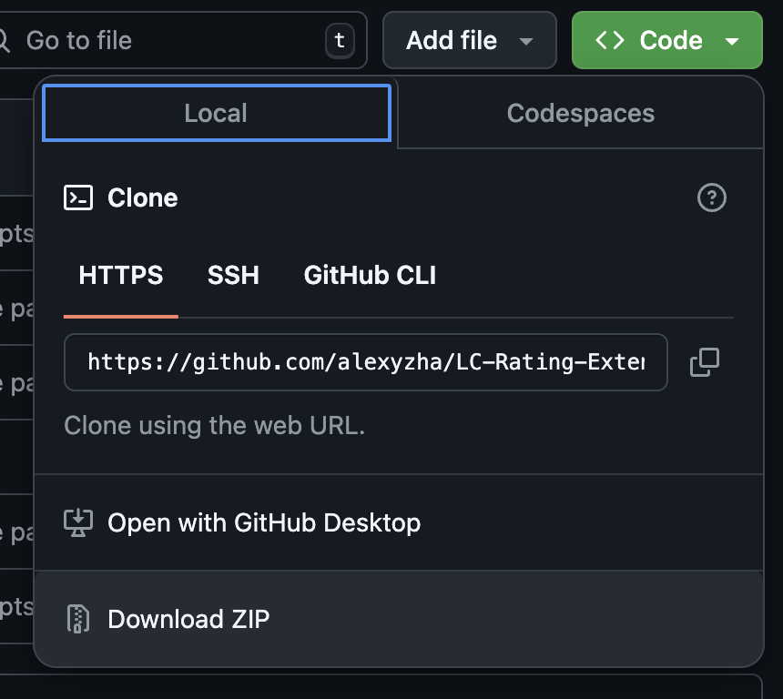
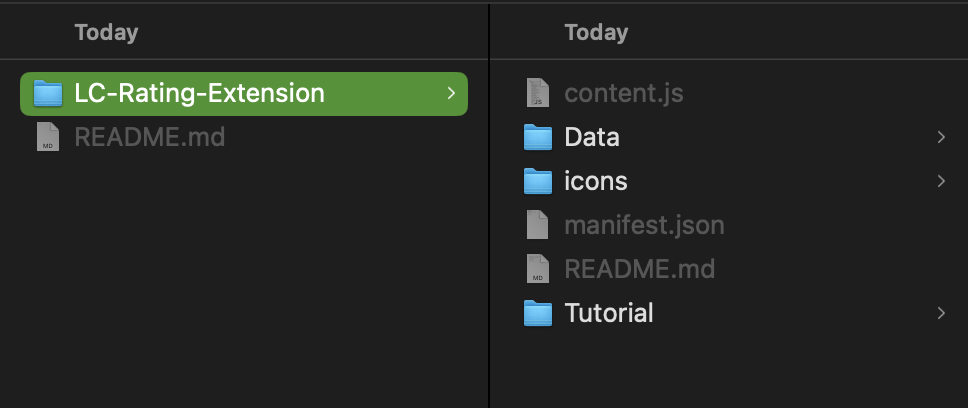
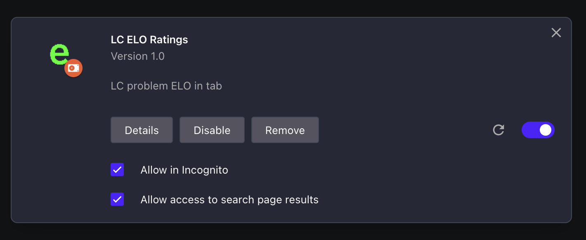

# LC-Rating-Extension
Uses data from https://github.com/zerotrac/leetcode_problem_rating to display ELO ratings for LeetCode problems. Works on the US version of the site, built for Chrome/Opera (Chromium).

# Installation Instructions (Opera, should be similar for Chrome):

### 1. Go to extensions (opera://extensions).

### 2. Make sure you are in "developer mode":

### 3. Download this repository.

### 4. Near the top of the extensions tab, click "load unpacked".

### 5. Navigate to wherever the root folder of this repo is (should be called LC-Rating-Extension).

### 6. Once you load it into Opera/Chrome, it should look something like this:

### 7. Have fun LeetCoding! :D